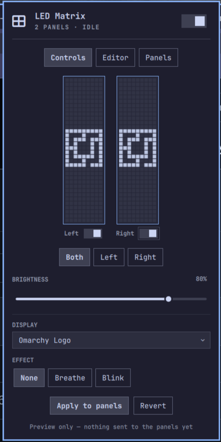
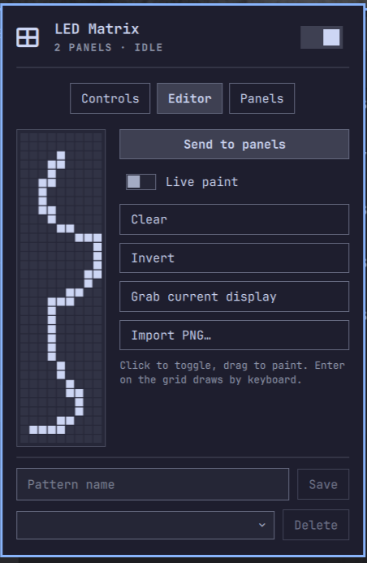
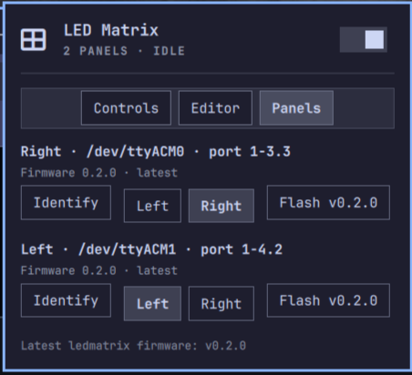

# Framework LED Matrix Helper

A control center for the Framework 16 LED Matrix input modules, living in the
Omarchy bar. Everything you set — patterns, text, animations, effects — shows
on a live emulation of both panels first, so you see exactly what you'll get
before applying it to the hardware. A built-in pixel-art editor lets you
draw, save, and share your own patterns as plain PNGs. Rounded out with
per-panel power and identity, full keyboard navigation, and in-place
firmware updates.


| Controls | Editor | Panels |
| :---: | :---: | :---: |
|  |  |  |

## Features

- **Live panel preview** — an emulation of both LED matrices in the popup
  renders every choice before it touches hardware: patterns, text (including
  how it splits across panels), animations ticking live, effects pulsing,
  brightness and sleep state. Selections show on the preview first; **Apply**
  sends them to the panels, Revert (or `x`) discards.
- **Display picker** — firmware patterns (logo, gradients, lotus, zigzag,
  all-on), free text, and streaming animations (clock, random EQ, mic EQ,
  bouncing Omarchy logo). One picker, because exactly one thing owns the grid
  at a time.
- **Effects** — breathing/blinking brightness modulation that composes with
  any static display, and is automatically unavailable while a streaming
  animation owns the grid.
- **Per-panel targeting** — control both panels or just the left/right one;
  text longer than 5 characters spans across both panels. Each panel has its
  own on/off switch under its preview (implemented as brightness-0 so running
  animations on the other panel are undisturbed).
- **Text positioning** — nudge text pixel-by-pixel within the panel bounds
  (arrow buttons, or Enter on the Position row for an hjkl/arrow nudge mode);
  shifted text is sent as rendered frames using the firmware's own font.
- **Stable left/right identity** — panels enumerate in random order per boot;
  assign each USB port a side once (with a brightness-pulse Identify helper)
  and the plugin keeps the order correct automatically.
- **Pattern editor** — draw your own 9×34 patterns on an Editor tab: click to
  toggle, drag to paint, or a keyboard draw mode (hjkl/arrows + Space). Send
  to the panels directly, optionally live-painting as you draw. Save patterns
  by name — they appear in the Display picker as `★ name` and are stored as
  plain 9×34 PNGs in
  `~/.local/share/godlewski.framework-led-matrix-helper/patterns/`, directly
  usable with `inputmodule-control --image-bw` — exporting/sharing a pattern
  is just copying the file. **Importing works too**: the *Import PNG…*
  button opens the desktop file chooser and accepts any 9×34 PNG (grayscale,
  RGB, palette, or alpha — drawn in any editor); dropping files into the
  patterns folder or `bin/led-matrix-ctl import-pattern <file> [name]` work
  as well.
- **Firmware flashing** — download a `.uf2` from
  [Framework's official releases](https://github.com/FrameworkComputer/inputmodule-rs/releases)
  (a button opens the page), pick the file, and the plugin flashes it in
  place (RP2040 UF2 flow) with streamed progress. The plugin never fetches
  or chooses firmware itself, and every image is structurally validated
  (UF2 block magics, RP2040 family ID) behind a confirmation dialog before
  it can touch the bootloader.
- **Stays lit** — the firmware normally fades panels out 60 seconds after the
  last command, so static patterns would vanish; the widget keeps what you
  applied visible with a lightweight keepalive (sleeping panels via the power
  switch still saves power as before).
- **Bar conveniences** — scroll the bar icon to change brightness,
  right-click to sleep/wake, full keyboard navigation (j/k/h/l, Enter, Esc,
  Tab) matching the first-party Omarchy panels.

## Requirements

- Framework 16 with one or two LED Matrix input modules
- [`inputmodule-control`](https://github.com/FrameworkComputer/inputmodule-rs)
  (AUR), plus `python3` (in the Omarchy base install)

**Missing something? The widget guides you.** When a dependency is absent the
bar icon shows a setup state whose panel explains what's missing and offers
an *Install dependencies* button (runs `yay` in an Omarchy floating
terminal). Manual equivalent: `yay -S inputmodule-control`. If serial access
is denied on your setup, also install `inputmodule-udev` from the AUR.

## Install

```sh
omarchy plugin add https://github.com/godlewski/omarchy-framework-led-matrix-helper --enable
```

Or clone into `~/.config/omarchy/plugins/godlewski.framework-led-matrix-helper`
and run `omarchy plugin enable godlewski.framework-led-matrix-helper`.

## Usage

Click the bar icon (or `omarchy-shell shell toggle
godlewski.framework-led-matrix-helper`) to open the panel.

- **Controls tab** — pick the target panel(s), set brightness, choose what to
  display, and add a breathing/blinking effect.
- **Panels tab** — identify which physical panel is which, assign Left/Right
  to their USB ports, and update firmware.

### IPC

```sh
omarchy-shell godlewski.framework-led-matrix-helper toggle|open|close|sleep|wake|refresh
```

Useful for keybindings, e.g. sleeping the panels before a presentation.

### Settings

Stored in the widget's `~/.config/omarchy/shell.json` entry (managed from the
Panels tab; no manual editing needed): `leftPort` / `rightPort` (USB port
paths for side identity) and `swapped` (derived automatically once ports are
assigned).

## Removal

```sh
omarchy plugin remove godlewski.framework-led-matrix-helper
```

State/caches you may also delete:
`~/.local/state/godlewski.framework-led-matrix-helper/`,
`~/.cache/godlewski.framework-led-matrix-helper/`.

## Development

Agent/contributor docs live in `CLAUDE.md`, with deeper references in
`.claude/skills/` (shell UI kit, hardware/CLI semantics, dev loop).

## Credits

The panel emulation embeds the 5×6 pixel font, lotus bitmap, and pattern
algorithms from Framework's
[inputmodule-rs](https://github.com/FrameworkComputer/inputmodule-rs)
(MIT © Framework Computer Inc), which also provides the `inputmodule-control`
CLI and firmware this plugin drives. The bouncing-logo animation and logo
bitmap are ported from [Omarchy](https://omarchy.org) (MIT).

## License

[MIT](LICENSE)
